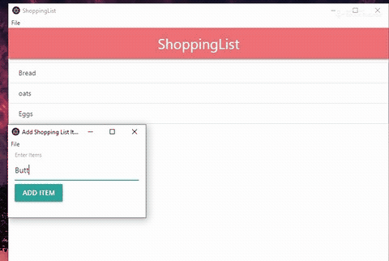

## Electron-ShoppingList

#### Steps to follow:
  
   1. Make a folder `electron/project/main.js`
   2. Open git bash, cd into `electron/project` and type `npm init`
   write on;
    
            discription: "anything you want"
            entry point: main.js
            author:  "anything"
            licence: MIT
            PRESS "ENTER"  

         ###### now `package.json ` is created automatically
                 
   3. Open `package.json` and change the code with github `package.json` file.
   
      Command :                        
      >npm install --save electron

      ###### This will create `package-lock.json` and add dependency on `package.json` file.

4. Make a file `electron/project/main.js` and copy `main.js` from github main.js file.

5. Make a file `electron/project/mainWindow.html` and copy github mainWindow.html file.
    
   Command :

    >npm start  "starts the app" 

    >ctrl+c "quit the app".

6. Make a file `electron/project/addWindow.html` and copy github `addWindow.html file` . 

7. Make a folder `electron/project/assets/icons`/
    - `win/icon.ico`
    - `mac/icon.icns`
    - `png/icon.png`

   **from github repo, download and paste these files.**  
    
8. Pulblishing the app;

    command 
     >electron install --save-dev electron-packager
    
9. Command
   >  nmp run package-win

  ######  this creates a folder `release-builds/"your app name" and the file with entension .exe` 

### This is our main APP

>##### just open it
        

>and....

>## Have Fun

---
---

###### If Help Needed   

   
 Contact me  
 
         
